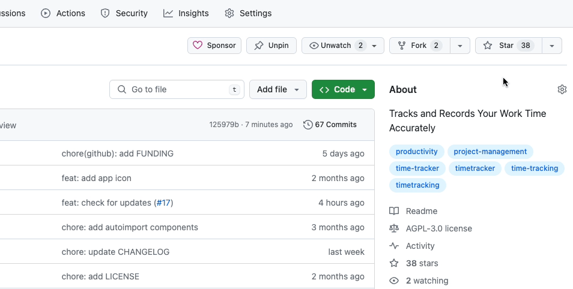

<p align="center">
  
</p>

<h1 align="center">Timefall</h1>

<p align="center">
  <strong>Built with Electron & Vue.</strong>
  <br>
  Inspired by Timemator.
</p>

<p align="center">
  
  
  
</p>

<p align="center">
  <a href="https://github.com/antonreshetov/timefall/releases">Latest Release</a> |
  <a href="https://github.com/antonreshetov/timefall/discussions">Discussions</a>
</p>

> [!CAUTION]
> Project is currently in an active development stage.
> We strongly recommend using our app for familiarization purposes only at this time. This will allow you to get acquainted with the main features and capabilities of our project, without risking the occurrence of unexpected situations.

## Support

Timefall is open source project and completely free to use.

However, the amount of effort needed to maintain and develop new features for the project is not sustainable without proper financial backing. You can support Timefall development via the following methods:

<div align="center">

[](https://paypal.me/antongithub)
[![Donate via Gumroad](https://img.shields.io/badge/donate-Gumroad-blue?style=popout&logo=data:image/svg+xml;base64,PHN2ZyB3aWR0aD0iMzQiIGhlaWdodD0iMzMiIHZpZXdCb3g9IjAgMCAzNCAzMyIgZmlsbD0ibm9uZSIgeG1sbnM9Imh0dHA6Ly93d3cudzMub3JnLzIwMDAvc3ZnIj4KPGVsbGlwc2UgY3g9IjE5LjgyODciIGN5PSIxOS4xMzU5IiByeD0iMTQuMTcxNCIgcnk9IjEzLjY3NjUiIGZpbGw9ImJsYWNrIi8+CjxwYXRoIGQ9Ik0xNi4xNzE0IDI5Ljk0NjRDMjQuNDAzMiAyOS45NDY0IDMxLjEyNDEgMjMuNDk5NSAzMS4xMjQxIDE1LjQ4ODdDMzEuMTI0MSA3LjQ3OCAyNC40MDMyIDEuMDMxMDEgMTYuMTcxNCAxLjAzMTAxQzcuOTM5NyAxLjAzMTAxIDEuMjE4NzUgNy40NzggMS4yMTg3NSAxNS40ODg3QzEuMjE4NzUgMjMuNDk5NSA3LjkzOTcgMjkuOTQ2NCAxNi4xNzE0IDI5Ljk0NjRaIiBmaWxsPSIjRkY5MEU4IiBzdHJva2U9ImJsYWNrIiBzdHJva2Utd2lkdGg9IjEuNTYyNSIvPgo8cGF0aCBkPSJNMTUuMDQ2NyAyMi43ODI3QzEwLjg2MiAyMi43ODI3IDguNDAwMzkgMTkuNDAyNCA4LjQwMDM5IDE1LjE5NzZDOC40MDAzOSAxMC44Mjc5IDExLjEwODEgNy4yODI3MSAxNi4yNzc0IDcuMjgyNzFDMjEuNjEwOSA3LjI4MjcxIDIzLjQxNiAxMC45MTA0IDIzLjQ5ODEgMTIuOTcxNUgxOS42NDE2QzE5LjU1OTYgMTEuODE3MyAxOC41NzQ5IDEwLjA4NTkgMTYuMTk1NCAxMC4wODU5QzEzLjY1MTggMTAuMDg1OSAxMi4wMTA3IDEyLjMxMiAxMi4wMTA3IDE1LjAzMjdDMTIuMDEwNyAxNy43NTM1IDEzLjY1MTggMTkuOTc5NSAxNi4xOTU0IDE5Ljk3OTVDMTguNDkyOSAxOS45Nzk1IDE5LjQ3NzUgMTguMTY1NyAxOS44ODc4IDE2LjM1MTlIMTYuMTk1NFYxNC44Njc4SDIzLjk0MzJWMjIuNDUyOUgyMC41NDQyVjE3LjY3MUMyMC4yOTggMTkuNDAyNCAxOS4yMzEzIDIyLjc4MjcgMTUuMDQ2NyAyMi43ODI3WiIgZmlsbD0iYmxhY2siLz4KPC9zdmc+Cg==)](https://antonreshetov.gumroad.com/l/timefall)

</div>

## About

The Timefall project is an open-source software that is being developed to provide users with an efficient and convenient time management tool. Created with modern software trends in mind, Timefall is a tool accessible to anyone who wants to better understand how they allocate their time and how it can be used most productively. It's a simple yet powerful tool capable of adapting to each user's needs.

## Features

### Task Creation with Hourly Rate

The app allows you to create tasks and specify an hourly rate for each task. This feature is useful for tracking time and calculating payment.

### Task Organization
You can organize your tasks by grouping them into folders. This helps you easily find relevant tasks and manage them efficiently.

### Time Entries with Hourly Rate Calculation

Timefall displays time entries grouped by days. You’ll see how much time was spent on each task, along with the calculated hourly payment.

### Reports for Weeks, Months, and Years

You can analyze your productivity by viewing reports for different time periods. This feature helps you understand how effectively you manage your time.

### Privacy
Timefall uses a simple JSON-based database stored locally on your computer, rather than in the cloud.

## Who is Timefall Useful for?

### Freelancers and Self-Employed Professionals
Freelancers working on various projects can utilize Timefall to track their billable hours accurately. Whether you’re a freelance writer, designer, developer, or consultant, this app helps you manage your time and calculate earnings.

### Software Developers and Designers
Developers and designers often juggle multiple tasks simultaneously. Timefall assists them in organizing their work, tracking time spent on coding, designing, and debugging, and ensuring efficient project management.

### Consultants and Sales Agents
Consultants, sales representatives, and agents who bill clients based on hours worked can benefit from Timefall. It simplifies time tracking, allowing them to focus on client interactions and project delivery.

### Students and Researchers
Students working on research projects, assignments, or thesis writing can use Timefall to allocate time effectively. It helps them stay on track and meet deadlines.

### Project Managers and Teams
Project managers can monitor team productivity by analyzing time entries. Timefall’s reports provide insights into resource allocation, project progress, and team performance.

### Personal Time Management
Anyone seeking better time management — whether for personal tasks, side projects, or hobbies — can leverage Timefall. It’s a versatile tool for staying organized and productive.

## Installation

App are available for Windows & macOS. You can download the latest version from the [Releases](https://github.com/antonreshetov/timefall/releases).

### macOS

If you encounter the error message `"Timefall" is damaged and can't be opened. You should move it to the Trash` while installing software on macOS, it may be due to security settings restrictions in macOS. To solve this problem, please try the following command in Terminal:

```bash
sudo xattr -r -d com.apple.quarantine /Applications/Timefall.app
```

## Development

### Prerequisites

The project uses Bun for building and running. Please make sure you have [Bun](https://bun.sh/) installed.

```
# Install dependencies
bun install

# Run the app
bun run dev
```

### Build

```
# Build the app
bun run make
```

## Follow
 - News and updates on [Twitter](https://twitter.com/anton_reshetov).
 - [Discussions](https://github.com/antonreshetov/timefall/discussions).



## License

[AGPL-3.0](https://github.com/antonreshetov/timefall/blob/master/LICENSE)

Copyright (c) 2024-present, [Anton Reshetov](https://github.com/antonreshetov).
