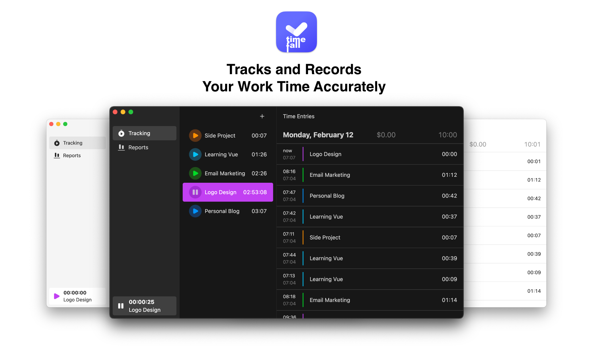

  

<h1 align="center">Timefall</h1>

  <strong>Built with Electron & Vue.</strong>
   
  Inspired by Timemator.

> [!CAUTION]
> Project is currently in an active development stage.

## About

The Timefall project is an open-source software that is being developed to provide users with an efficient and convenient time management tool. Created with modern software trends in mind, Timefall is a tool accessible to anyone who wants to better understand how they allocate their time and how it can be used most productively. It's a simple yet powerful tool capable of adapting to each user's needs.

## License

[AGPL-3.0](https://github.com/antonreshetov/timefall/blob/master/LICENSE)

Copyright (c) 2024-present, [Anton Reshetov](https://github.com/antonreshetov).